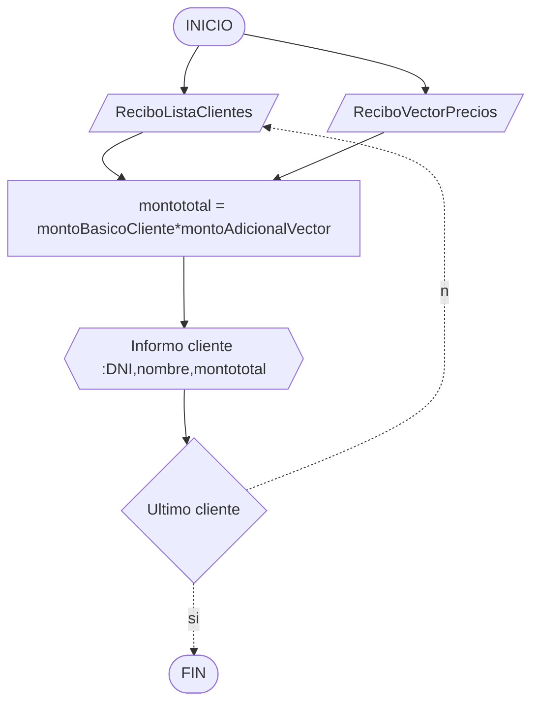

```mermaid
 flowchart TD
 I([INICIO]) --> Par1[/ReciboListaClientes/]
 I --> Par2[/ReciboVectorPrecios/]
 Par1 & Par2 --> Proce1[montototal = montoBasicoCliente*montoAdicionalVector]
 Proce1 --> Informar{{Informo cliente :DNI,nombre,montototal}}
 Informar --> If{Ultimo cliente}
 If -.no.-> Par1
 If -.si.-> F([FIN])
```