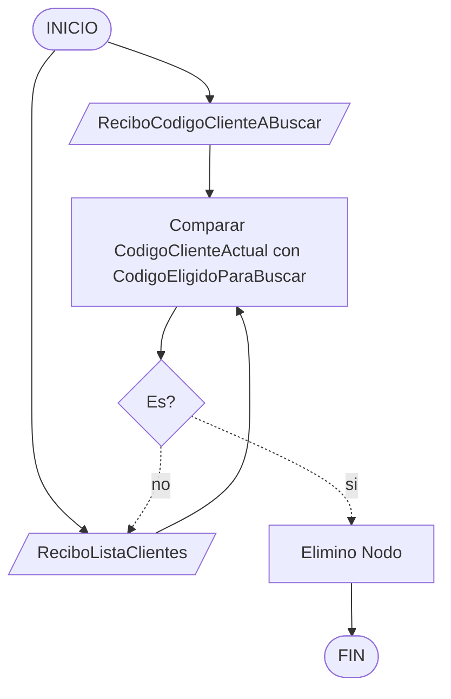

```mermaid
    flowchart TD
    I([INICIO]) --> Par1[/ReciboCodigoClienteABuscar/] & Par2[/ReciboListaClientes/]
    Par1 & Par2 --> Proce[Comparar CodigoClienteActual con CodigoEligidoParaBuscar]
    Proce --> If{Es?}
        If -.no .-> Par2
        If -.si .-> Proce2[Elimino Nodo]
    Proce2 --> F([FIN])
```