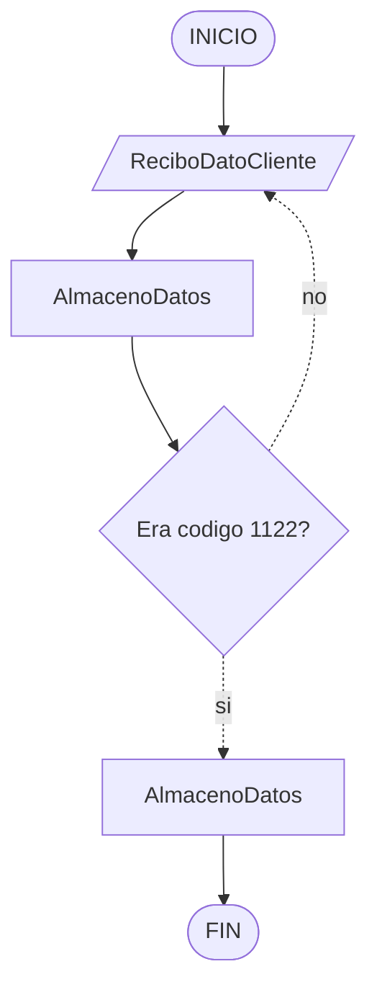

```mermaid
 flowchart TD
 I([INICIO]) --> Par[/ReciboDatoCliente/]
 Par --> Proceso1[AlmacenoDatos]
 Proceso1 --> If{Era codigo 1122?}
 If-. no .-> Par
 If-. si .-> Proceso1s[AlmacenoDatos]
 Proceso1s --> F([FIN])
```